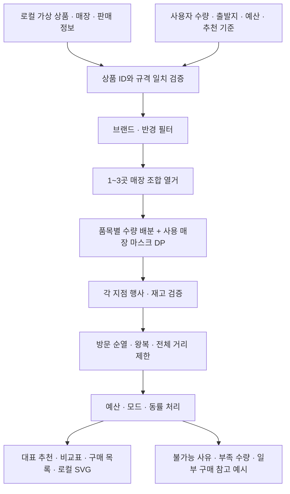

# 장바구니 구매 계획 계산 흐름

## TEST 데이터와 정확한 전체 구매 추천

<!-- mermaid:id=basket_plan -->

```mermaid
flowchart TD
  A["로컬 가상 상품 · 매장 · 판매 정보"] --> C["상품 ID와 규격 일치 검증"]
  B["사용자 수량 · 출발지 · 예산 · 추천 기준"] --> C
  C --> D["브랜드 · 반경 필터"]
  D --> E["1~3곳 매장 조합 열거"]
  E --> F["품목별 수량 배분 + 사용 매장 마스크 DP"]
  F --> G["각 지점 행사 · 재고 검증"]
  G --> H["방문 순열 · 왕복 · 전체 거리 제한"]
  H --> I["예산 · 모드 · 동률 처리"]
  I --> J["대표 추천 · 비교표 · 구매 목록 · 로컬 SVG"]
  I --> K["불가능 사유 · 부족 수량 · 일부 구매 참고 예시"]
```
